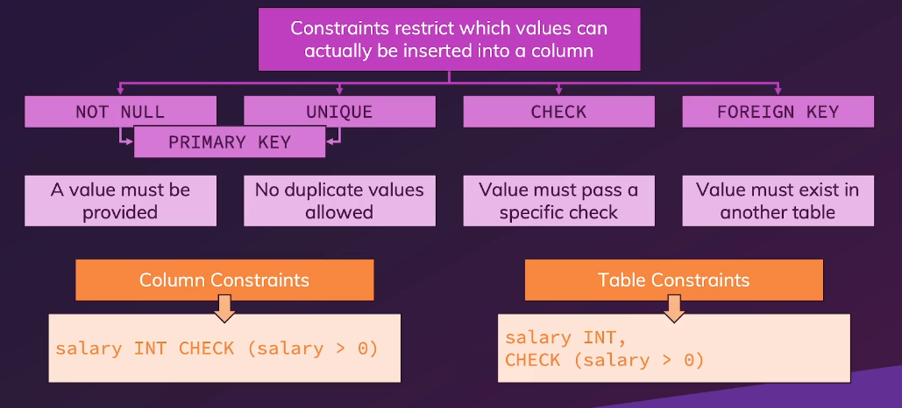

### SQL

### Query Classification

### Aggregate Functions

AVG,COUNT,MIN,MAX,SUM,...

### '' or ""

'' => for strings
"" => for table/column names

### Order of Operations

1. FROM clause (including any JOIN operations)
2. WHERE clause
3. GROUP BY clause (if present)
4. HAVING clause (if present)
5. SELECT clause
6. ORDER BY clause
7. LIMIT clause (if present)

### Types of Indexes

1. Single column
2. Multi column
3. Unique
4. Partial
5. Implicit indexes

### When to use Index

1. Index foreign keys
2. Index primary keys and unique columns
3. Index on columns that end up in the ORDER BY/WHERE clause

### When not to use Index

1. Don't add an index just to add one
2. Don't use on small tables
3. Don't use on tables that are update frequently
4. Don't use on columns that can contain NULL values
5. Don't use on columns that have large values

### Postgres Indexing Algorithms

1. B-Tree
2. Hash
3. Gin
4. Gist
